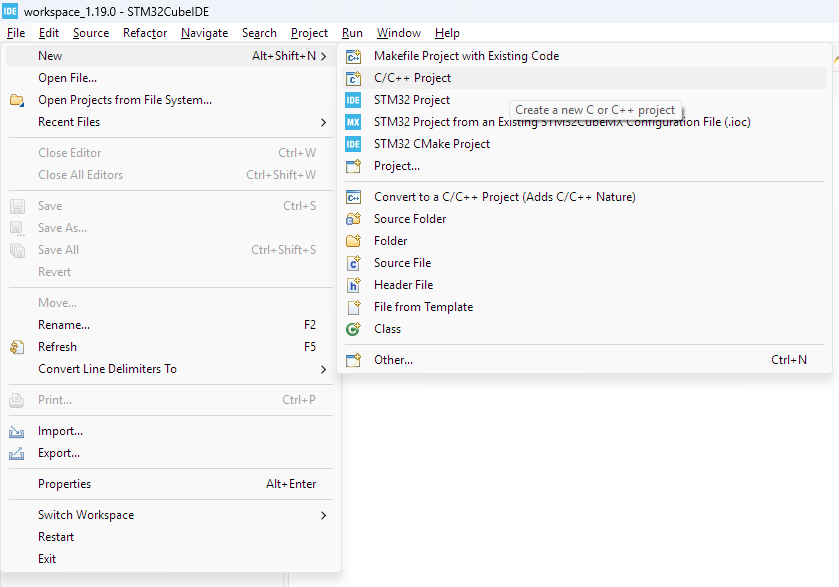
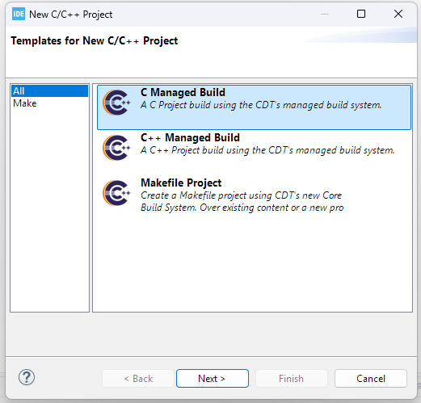
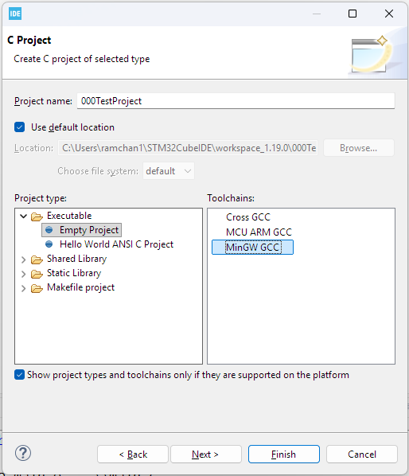
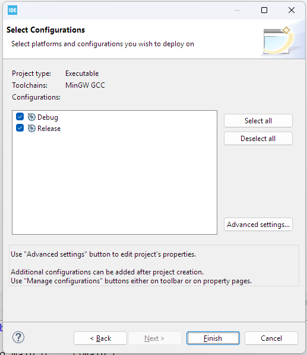
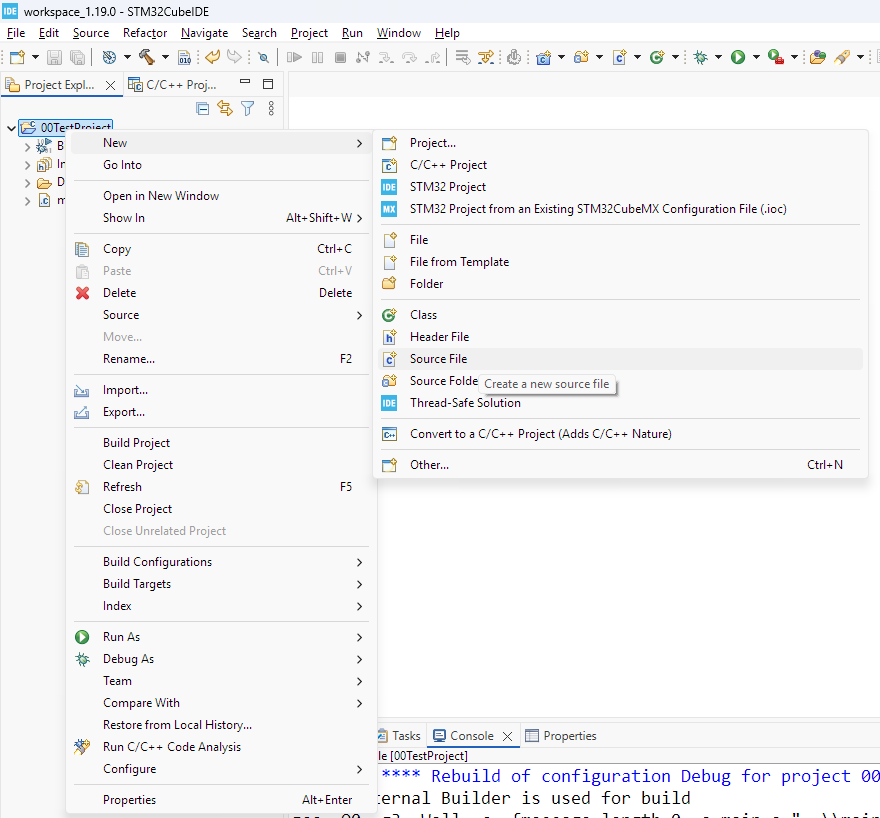
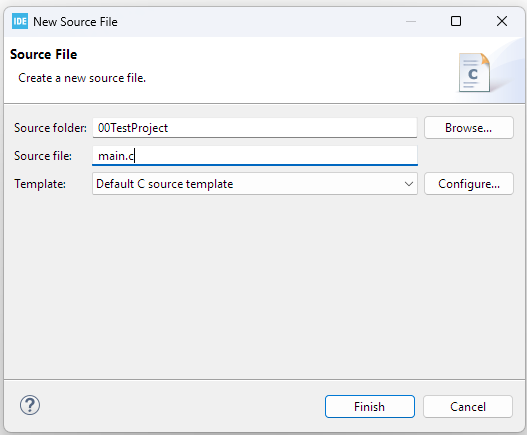
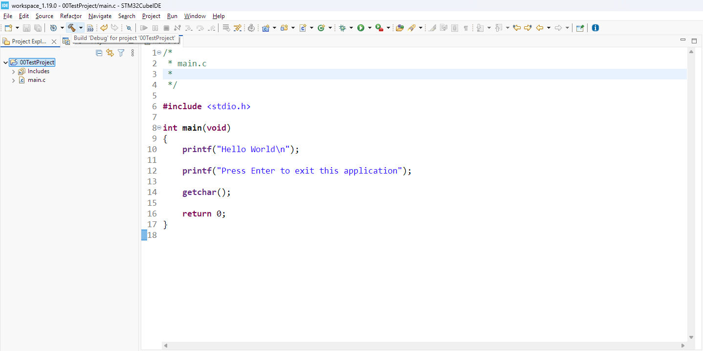
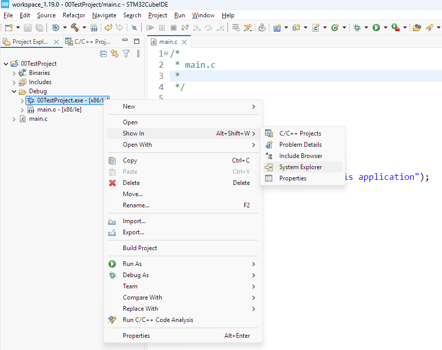
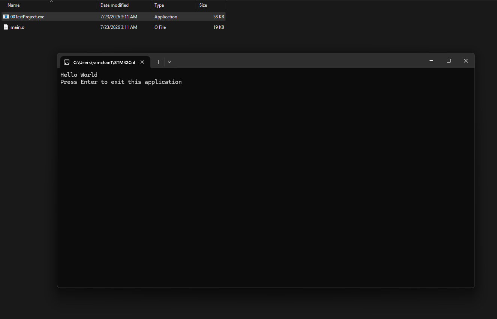

# Steps to create the Project for the Host
- Host is the PC which is being used for the development

## Host Project Creation
### Step 1. Create a C/C++ Project.


### Step 2. Choose C Managed Build & Click Next


### Step 3. Give Project Name and Choose `MinGW GCC` Toolchains for windows & Click Next


### Step 4. Click Finish & Project is created


### Step 5. Add Source File to the Project


### Step 6. Write file name and Click on Finish


### Step 7. Write code in the main.c file
```c
#include <stdio.h>

int main(void)
{
	printf("Hello World\n");

	printf("Press Enter to exit this application");

	getchar();

	return 0;
}
```

### Step 8. Build the Project/Compile the Project


### Step 9. Open the Executable File


### Step 10. Open the file for the Output


