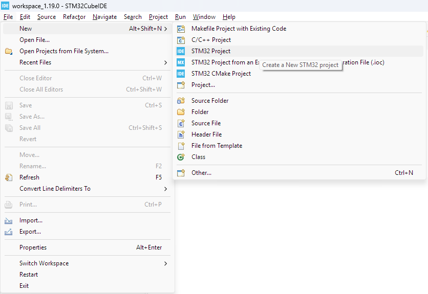
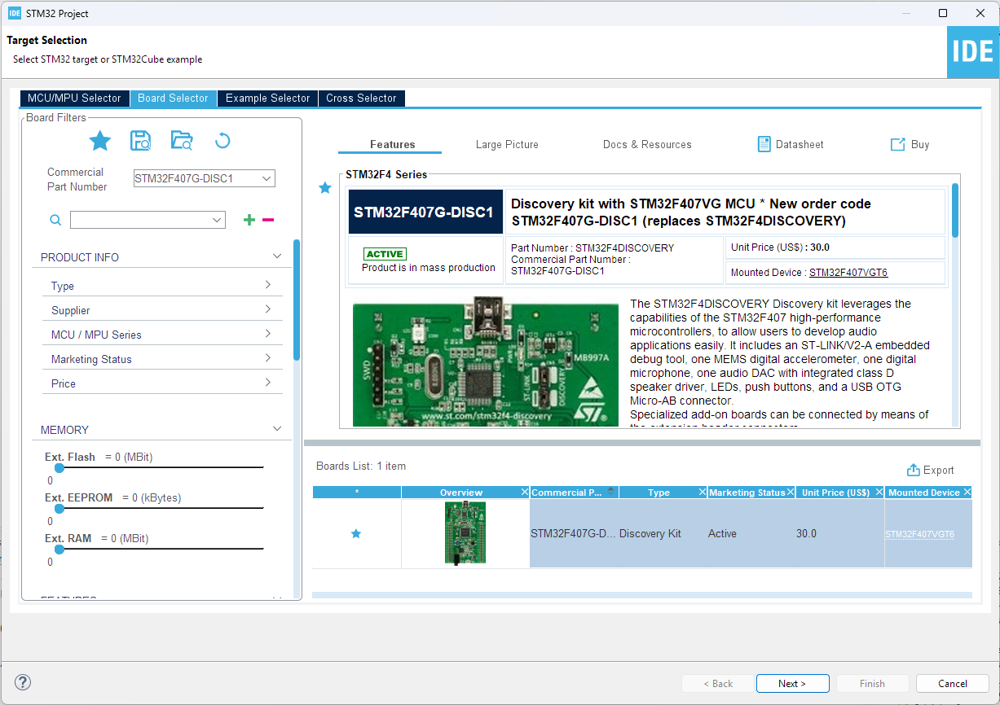
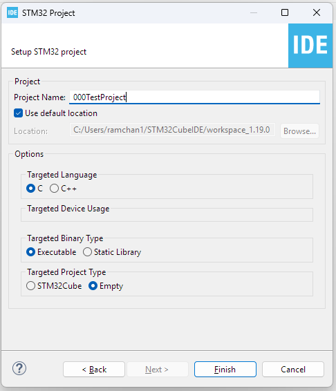
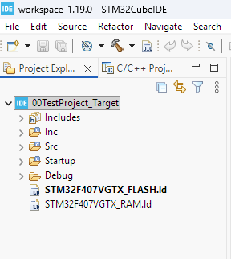
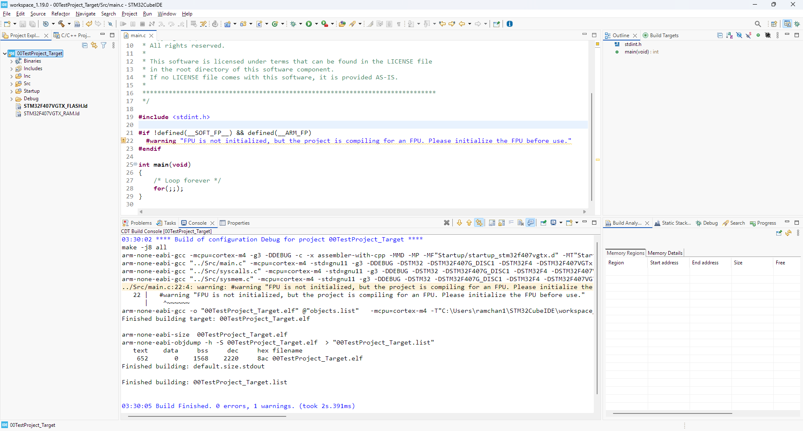
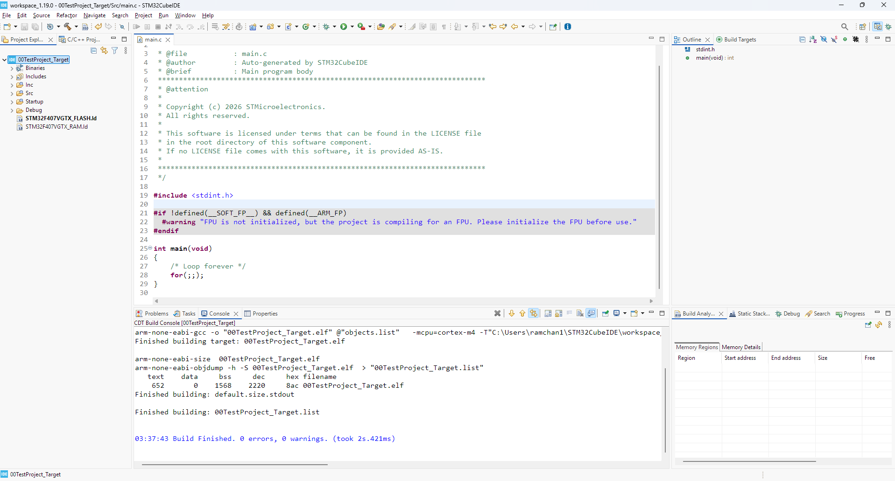

# Steps to create the Project for the Target
- Target is the board for which the code is being developed.

## Host Project Creation
### Step 1. Create an STM32 Project.

### Step 2. Click on the Board Selector & Write the Board Name & Click Next

### Step 3. Give Project Name & Select the Targeted Project Type as `Empty` & Click Finish

### Step 4. Project is created

### Step 5. Build the Project

### Step 6. FPU warning fix
- If you find the below warning message , apply the fix as described here:
"FPU is not initialized, but the project is compiling for an FPU. Please initialize the FPU before use."

- So, what is this warning about ?
  - The build is giving a warning that, in the build settings hardware floating point unit of the processor is enabled but it is not initialized that using the code.
  - So, it is giving a warning to initialize it before using any floating point related code otherwise it may result in processor fault exception.

- To get rid of this problem:
  - Properties -> Expand C/C++ build --> Settings --> Tool settings -->MCU settings
  - Keep the Floating-point unit: None
  - Keep the Floating-point ABI: Software implementation(-mfloat-abi=soft)

- Click apply and close.

