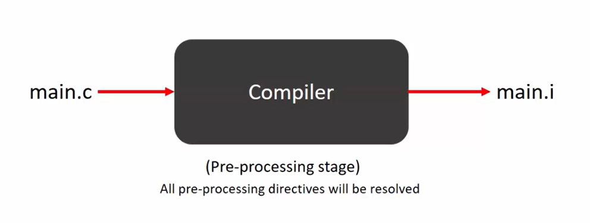
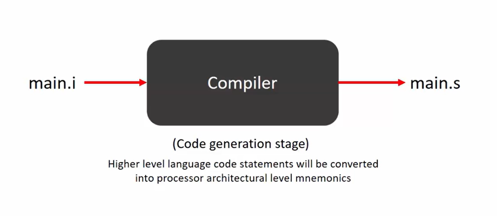

# First 'C' Program "Hello World"
- Let's write a 'C' code which simply displays the text Hello World on the "console" and exits.
- Every C program has a main function, it is the starting point of the program execution.
- Every C statement ends with ;.
- For print we have to include a standard entry file.

```c
/*
 * According to C90 and C99 standards
 * main() should return int
 *
*/
#include <stdio.h>

int main()
{
    printf("Hello World\n");
    return 0;
}
```

- If we use the compiler tag i.e. -save-temps, it will save all the temporary files.





## Print the following output using the C program
```text
Hello World!
Today is a great Day!

... Program finished with exit code 0
Press ENTER to exit console
```
